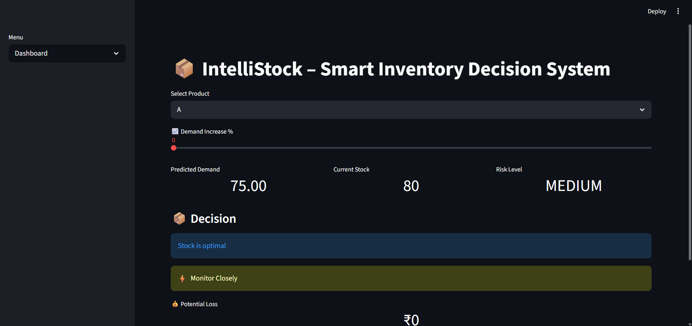

# IntelliStock – AI Inventory Decision System

## 🚀 Description
An AI-powered system that predicts demand, analyzes risk, and provides smart inventory decisions.

## 🧠 Features
- Demand Forecasting
- Risk Analysis
- Smart Restock Decisions
- AI Advisor

## 🛠 Tech Stack
- Python
- Streamlit
- Prophet
- OpenAI API

## ▶️ How to Run
pip install -r requirements.txt
streamlit run app.py

## 📸 Screenshots

